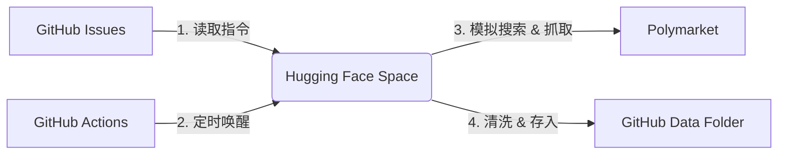

# 🌍 Macro Scouter (宏观信号监测哨兵)

> **"Data is the new oil, but signal is the new gold."**
> 一个基于 Polymarket 预测市场的自动化宏观经济监测系统。零代码配置，高信噪比，GitHub 原生体验。

## 🚀 项目简介

**Macro Scouter** 是一个去中心化的宏观数据抓取与分析 Agent。它利用 Puppeteer 模拟真人行为，从全球最大的预测市场 Polymarket 抓取最真实的真金白银交易数据（非单纯的民意调查），并清洗出高价值的宏观信号。

### ✨ 核心特性

* **无代码控制台 (IssueOps)**: 不需要修改一行代码，直接通过 **GitHub Issues** 进行管理。
    * 新增监控 👉 发个 Issue
    * 修改关键词 👉 改 Issue 标题
    * 停止监控 👉 关闭 Issue
* **高信噪比 (Signal-Only)**: 内置智能过滤器。
    * 自动剔除 `Volume < 100` 的死盘。
    * 自动剔除 `Spread > 5%` 的无效博弈。
    * 自动识别并修正 `live/news` 等无效链接。
* **永久免费架构**: 
    * **大脑**: GitHub Issues (配置)
    * **手脚**: Hugging Face Docker (执行，16GB RAM)
    * **仓库**: GitHub Repo (存储 JSON 数据)
    * **扳机**: GitHub Actions (定时触发)

---

## 🛠️ 架构图



---

## 🕹️ 如何使用

### 1. 启动/增加监控

在仓库的 [Issues 页面](https://www.google.com/search?q=../../issues) 点击 **New Issue**。

* **标题**: 输入你想监控的问题（支持动态占位符）。
* **内容**: 留空即可。

#### 💡 支持的动态占位符：

代码会自动将这些标签替换为实时日期，实现自动化轮动监测。

* `{month}`: 自动替换为当前月份 (e.g., *January*)
* `{next_month}`: 自动替换为下个月 (e.g., *February*)
* `{year}`: 当前年份 (e.g., *2026*)
* `{date}`: 当前日期 (e.g., *January 28*)

#### 📝 示例标题：

* `Fed decision in {month}?` (自动搜: *Fed decision in January?*)
* `Will S&P 500 hit 6000 in {year}?`
* `Bitcoin price on {date}?`

### 2. 停止监控

直接在 Issues 列表里找到对应的问题，点击 **Close Issue**。系统下次运行时会自动忽略它，不再浪费资源。

### 3. 查看数据

所有抓取到的数据会自动按日期归档在 `data/strategy/YYYY-MM-DD/` 目录下。

---

## 🧠 推荐策略 (宏观 8 问)

你可以直接复制以下标题到 Issues 中，作为初始监控列表：

1. **黄金月度交割价 (避险核心)**
> `What will Gold (GC) settle at in {month}?`


2. **黄金月度高点**
> `What will Gold (GC) hit__ by end of {month}?`


3. **美联储决议 (宏观核心)**
> `Fed decision in {month}?`


4. **比特币月度目标价**
> `What price will Bitcoin hit in {month}?`


5. **年度降息预期**
> `How many Fed rate cuts in {year}?`


6. **BTC 历史新高预测**
> `Bitcoin all time high by ___?`


7. **BTC 单日价格 (短线)**
> `Bitcoin price on {date}?`


8. **BTC 关键点位 (强弱)**
> `Bitcoin above ___ on {date}?`


---

## ⚙️ 部署参数

| 环境变量 | 说明 |
| --- | --- |
| `GITHUB_TOKEN` | 必须具备 `repo` 权限以读取 Issue 和写入数据 |
| `REPO_OWNER` | GitHub 用户名 (e.g., *wenfp108*) |
| `REPO_NAME` | 仓库名称 (e.g., *poly-data*) |

---

## 📊 数据样本

数据存储为纯净的 JSON 格式，包含核心博弈数据与黑天鹅预警指标。

```json
{
    "slug": "fed-decision-in-january",
    "question": "No change",
    "prices": "Yes: 99.6% | No: 0.4%",
    "volume": 89846871,
    "dayChange": "0.55%",
    "updatedAt": "2026-01-28T05:43:22Z"
}

```

---

*Built with ❤️ by **Woon***

```

```
