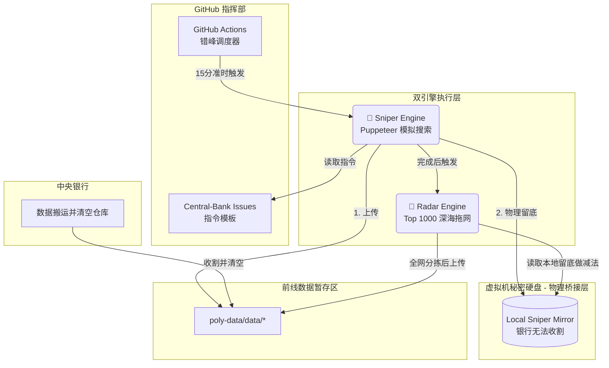

# 🌍 Macro Scouter (宏观信号监测哨兵)

> **"Data is the new oil, but signal is the new gold."**
> 一个基于 Polymarket 预测市场的自动化宏观情报决策系统。**大师策略加持，双引擎驱动，具备“银行级”抗收割稳定性。**

---

## 🚀 核心架构：大师增强型双引擎

本系统不仅是数据搬运工，更是具备“物理隔离”能力的智力审计系统。

### 1. 🎯 一号机 (Sniper - 定点打击)

* **职责**：定向狙击。直接连接你的 **Central-Bank 指令中心** (GitHub Issues)，根据模糊模板（如：`{date}` 价格、`{month}` 利率）自动扩展查询。
* **技术**：内置 **Puppeteer** 模拟搜索，通过语义识别锁定核心资产（黄金、BTC、联储决议）的每一个赔率波动。
* **特性**：支持 3天/2月/2年 的动态时间跨度扫描。

### 2. 📡 二号机 (Radar - 全域扫描)

* **职责**：深海拖网。每小时扫描全网成交额 **Top 1000** 的市场，确保不漏掉任何潜伏的热点。
* **物理减法**：**核心黑科技**。Radar 运行前会自动读取 Sniper 的“本地密室”文件，100% 剔除狙击手已占领的话题，将位置留给第 31-100 名的潜在黑天鹅。
* **特性**：**30 强守擂 + 板块踢馆机制**。强制捞回科技、科学等冷门板块的龙头情报，打破资金茧房。

---

## 🛡️ 核心黑科技：本地物理桥接 (Local Bridge)

针对**“中央银行高频收割并清空仓库”**的极限环境，系统实现了物理级隔离：

* **隐形传输**：Sniper 运行后在 GitHub 虚拟机的本地硬盘存底，不经过 API，中央银行无法跨域收割。
* **零延迟去重**：Radar 启动后优先读取本地硬盘备份。即便云端数据已被银行收走，减法逻辑依然 100% 成功。
* **阅后即焚**：整个任务结束，虚拟机自动销毁，不留任何痕迹，保证情报的私密性与仓库的整洁。

---

## 🧠 大师思维模型 (Strategy Engine)

系统通过 4 位顶级投资大师的逻辑对数据进行实时打标，存储于 `strategy_tags` 字段中：

| 大师 (Master) | 核心逻辑 (Logic) | 识别信号 | 宏观价值 |
| --- | --- | --- | --- |
| **塔勒布 (Taleb)** | **尾部风险** | 赔率 < 5% 或 > 95% + 流动性 | 发现被市场忽视的**“黑天鹅”**机会 |
| 索罗斯 (Soros) | 反身性 | 24h 成交激增 + 价格剧烈波动 | 捕捉资金驱动的**趋势反转**或泡沫 |
| 芒格 (Munger) | 确定性 | 极窄点差 + 巨额成交量 | 锁定共识统一的**“确定性事实”** |
| **纳瓦尔 (Naval)** | **科技杠杆** | 专注于 TECH 板块的高额投入项 | 监测具有**高杠杆属性**的技术突围点 |

---

## 🛠️ 系统逻辑流转图



---

## 🛡️ 板块监测准则 (Filtering Rules)

二号机 (Radar) 内置严格的板块隔离墙，确保你看到的永远是硬核宏观：

| 板块 (Category) | 监控核心 (Signals) | 筛选算法 (Sorting) |
| --- | --- | --- |
| **Politics** | 官员任命、政府停摆、大选趋势 | 按 24h 成交量 (Vol) |
| **Economy** | Fed 降息、CPI、就业数据 | 按 24h 成交量 (Vol) |
| **Finance** | 黄金、原油、S&P 500 | **按流动性 (Liquidity)** |
| **Tech** | AI 模型竞争、半导体、SpaceX | 按 24h 成交量 (Vol) |
| **Geopolitics** | 军事冲突、停火协议、边境风险 | 按 24h 成交量 (Vol) |
| **Science** | 地震预警、病毒监测、极端气温 | **按流动性 (Liquidity)** |

---

## 🕹️ 运行与报告示例

数据以脱水后的结构化 JSON 存储，每一条都带有战略指引：

```json
{
  "slug": "fed-decision-in-march",
  "question": "25+ bps increase",
  "eventTitle": "Fed decision in March?",
  "prices": "Yes: 0.8% | No: 99.2%",
  "vol24h": 1870303,
  "category": "ECONOMY | POLITICS",
  "strategy_tags": ["TAIL_RISK", "HIGH_CERTAINTY"],
  "bridge_status": "local_subtracted"
}

```
