# 🌍 Macro Scouter (宏观信号监测哨兵) 

> **"Data is the new oil, but signal is the new gold."**
> 一个基于 Polymarket 预测市场的自动化宏观经济监测系统。**大师策略加持，双引擎驱动，高信噪比。**

---

## 🚀 核心架构：大师增强型双引擎

本系统在 2.0 版本中引入了**大师策略引擎**，不再仅仅是搬运数据，而是对每一条赔率进行“智力审计”。

### 1. 🎯 一号机 (Sniper - 守正)

* **职责**：定向狙击。根据你在 **GitHub Issues** 中定义的指令（如美联储决议、黄金走势）进行深度扫描。
* **特性**：支持 `{month}` 动态占位符；内置大师打标，捕捉核心标的的极端定价机会。

### 2. 📡 二号机 (Radar - 出奇)

* **职责**：全网搜索。每小时扫描全站成交额 Top 100 的市场，发现你意料之外的黑天鹅。
* **特性**：**7 大板块过滤** + **大师逻辑筛选**。自动剔除娱乐噪音，只留硬核信号。

---

## 🧠 大师思维模型 (Strategy Engine)

系统通过 4 位顶级投资大师的逻辑对数据进行实时打标，结果存储于 JSON 的 `strategy_tags` 字段中：

| 大师 (Master) | 核心逻辑 (Logic) | 识别信号 | 宏观价值 |
| --- | --- | --- | --- |
| **塔勒布 (Taleb)** | **尾部风险** | 赔率 < 5% 但流动性充足 | 发现被市场忽视的**“黑天鹅”**机会 |
| 索罗斯 (Soros) | 反身性 | 24h 成交激增且价格剧烈波动 | 捕捉由资金驱动的**趋势反转**或大户操纵 |
| 芒格 (Munger) | 确定性 | 极窄点差 + 巨额成交量 | 锁定共识高度统一的**“确定性事实”** |
| **纳瓦尔 (Naval)** | **科技杠杆** | 专注于 TECH 板块的高额投入项目 | 监测具有**高杠杆属性**的技术突围点 |

---

## 🛠️ 系统架构图

```mermaid
graph TD
    subgraph GitHub_HQ [GitHub 指挥部]
        A1[GitHub Issues<br/>狙击指令]
        A2[GitHub Actions<br/>错峰调度器]
    end

    subgraph Logic_Layer [策略打标层]
        M1[Taleb: 尾部风险]
        M2[Soros: 反身性]
        M3[Munger: 确定性]
        M4[Naval: 科技杠杆]
    end

    subgraph Execution_Layer [Hugging Face 执行层]
        B1(🎯 Sniper Engine<br/>定向抓取)
        B2(📡 Radar Engine<br/>全网扫描)
    end

    subgraph Data_Vault [私有数据金矿]
        C1[(data/strategy<br/>定向情报)]
        C2[(data/trends<br/>宏观趋势)]
    end

    A2 -- "触发" --> B1 & B2
    B1 -- "读取指令" --> A1
    B1 & B2 -- "数据预处理" --> Logic_Layer
    Logic_Layer -- "打标 Tags" --> C1 & C2

```



---

## 🛡️ 板块监测准则 (Filtering Rules)

二号机 (Radar) 内置严格的板块隔离墙，确保你看到的永远是硬核宏观：

| 板块 (Category) | 监控核心 (Signals) | 剔除噪音 (Noise) |
| --- | --- | --- |
| **Politics** | 美国大选、官员任命、政府停摆 | 民调、社交媒体推文、着装 |
| **Economy** | Fed、CPI、就业、衰退风险 | 边缘国家数据、一般性声明 |
| **Finance** | 黄金、原油、S&P 500、大市值公司 | 财报细节、常规并购、IPO |
| **Tech** | AI 模型基准、Nvidia、半导体、AGI | 游戏、App 下载排名、网红 |
| **Geopolitics** | 军事冲突、停火协议、边境风险 | 边缘小国选举、常规外交访问 |
| **Science** | 极端天灾、病毒预警、SpaceX 进展 | 局部城市天气、降雪/降雨量 |

---

## 🕹️ 运行与配置

### 1. 添加监控目标

在 GitHub Issues 中新建 Issue，Sniper 引擎会自动识别：

* `Fed decision in {month}?` (自动替换为当前月与次月)
* `What will Gold (GC) settle at in {month}?`

### 2. 查看数据报告

数据以结构化 JSON 存储，包含 `strategy_tags` 战略分析：

```json
{
    "slug": "fed-decision-in-january",

    "ticker": "fed-decreases-interest-rates-by-50-bps-after-january-2026-meeting",

    "question": "50+ bps decrease",

    "eventTitle": "Fed decision in January?",

    "prices": "Yes: 0.1% | No: 100.0%",

    "volume": 231737266,

    "liquidity": 5363392,

    "endDate": "2026-01-28",

    "dayChange": "-0.10%",

    "vol24h": 14106410,

    "spread": "0.10%",

    "sortOrder": 0,

    "updatedAt": "2026-01-28T14:17:28.693057Z",

    "engine": "sniper",

    "core_topic": "Fed decision in {month}?",

    "category": "ECONOMY",

    "url": "https://polymarket.com/event/fed-decision-in-january",

    "strategy_tags": [

      "TAIL_RISK",

      "HIGH_CERTAINTY"
}

```

### 3. 环境变量 (Secrets)

| 变量名 | 说明 |
| --- | --- |
| `GITHUB_TOKEN` | 读写 Issue 和存储 Data 的权限 |
| `REPO_OWNER` | GitHub 用户名 (如: `wenfp108`) |
| `REPO_NAME` | 仓库名 (如: `poly-data`) |

---

*Built with ❤️ by **Woon**. Powered by Master-Logic Augmented Scouter Engine.*
